<b><i>
# ***Configuring the Haproxy Load Balancer and Apache Webserver using Ansible playbooks***

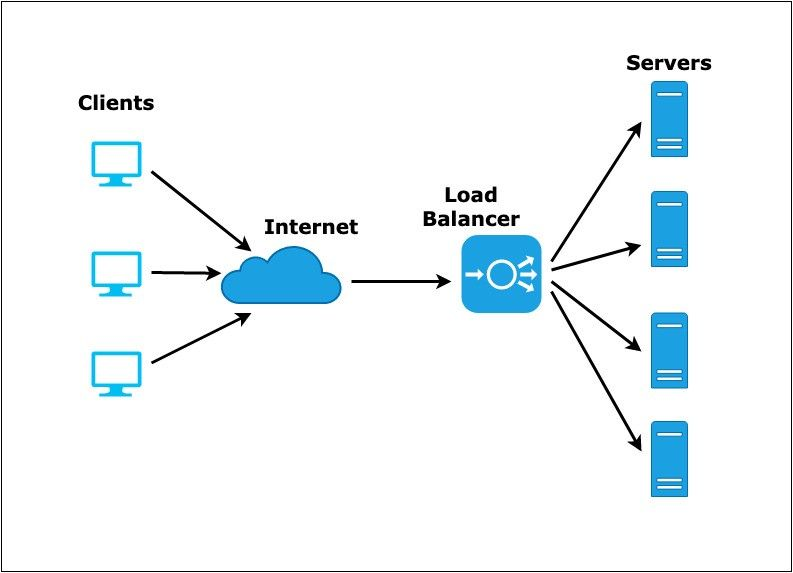

> ### Before moving ahead let’s first understand what is a load balancer?
* A load balancer is the one that will manage the incoming traffic from the client over our resources. we put this on the top of them and then the client hits them and they divided the load effectively and properly over our resources

> ### Task Description:
* Using the ansible-playbook configure the Reverse Proxy i.e Haproxy
* Update the configuration file of Haproxy automatically each time a new managed node (configured with apache webserver) join the inventory

## ***So Lets Go ...***

1. Firstly to manage all the code properly let’s create our workspace in my case I have created it as load_balancer folder. now this load_balancer folder will comprise all the playbook related to the task as well as the templates, variable files, etc which I will be using in the playbook

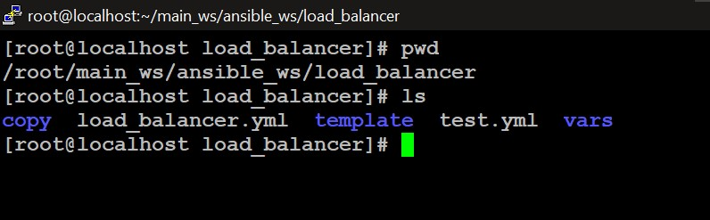

2. Now I have created the load_balancer.yml file which is my playbook inside my workspace. This playbook consists of 2 plays one for configuration of the load_balance and the other for configuration of the apache webserver.

3. In the load balancer part at the most, I have installed the haproxy software next copied my customized configuration file of haproxy in it via the template. then I have started the services. If new changes are found and made in the configuration file automatically service will restart.

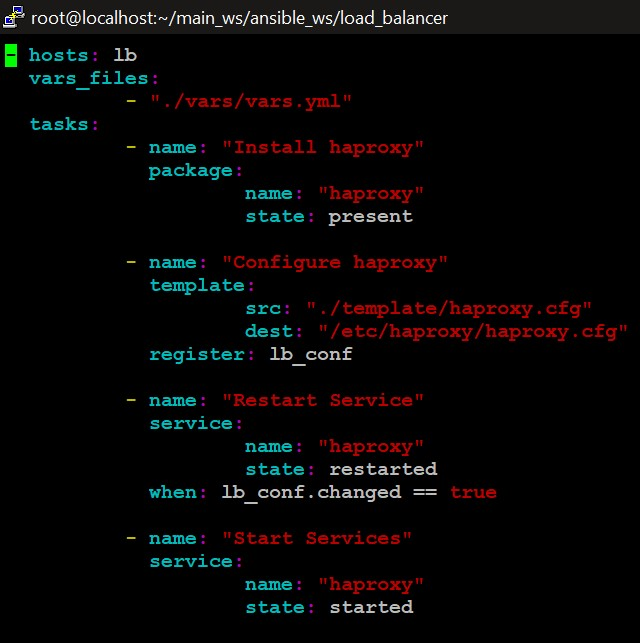

4. Now in the next part, we are configuring the apache web server. Here at the most, we are installing software like httpd and PHP. Next, we copy the customized configuration file for the apache web server in the hosts via templates further we create the customized document root and copy the webpages in it. In the configuration file, we mention this. Also further we are starting the services if changes in the configuration file are done they restart the services

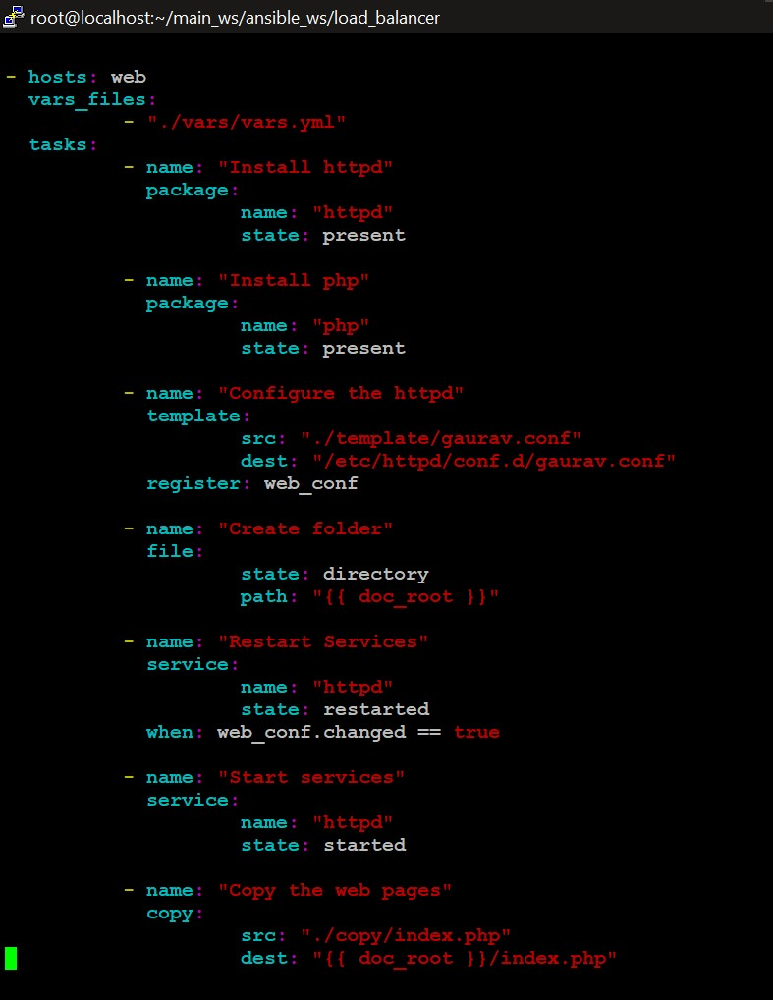

5. Now the variables mentioned in the whole playbook is been passed via the vars.yml file. here we can see I have set the load_balance port as 8081 (lb_port) and webserver port as 81 (web_port)

6. For the configuration of httpd I have created the gaurav.conf file which also compromises variables whose values are mention in the vars.yml file and the value of some variables will be provided by ansible_facts

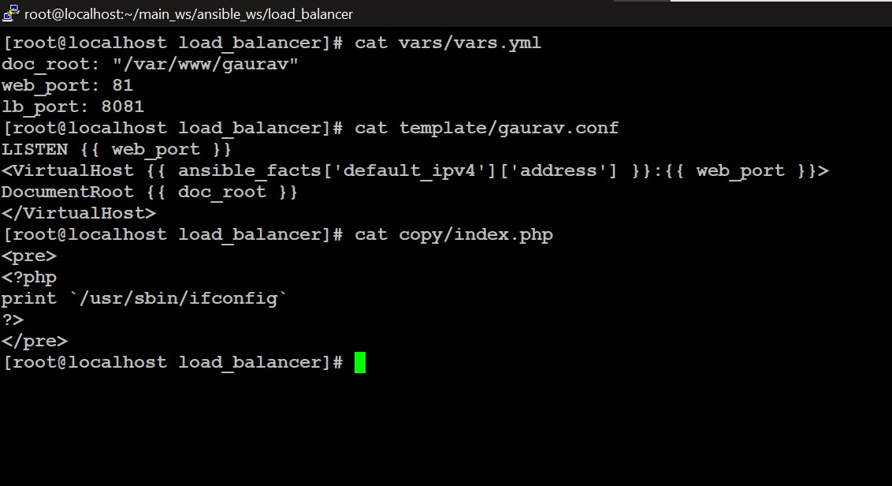

7. Now I have grouped all the backend servers in the inventory as web groups. We can check this using command
`#ansible web --list-hosts`

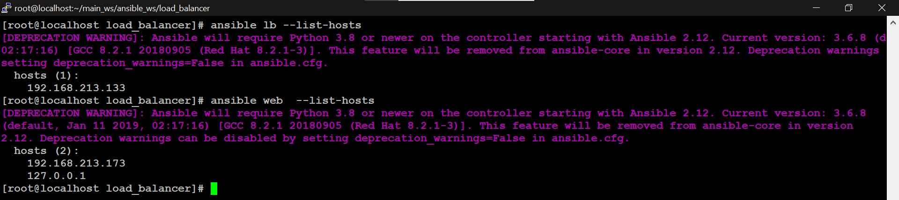

8. Now to add all those servers’ IP and ports dynamically I created the for loop and ask ansible to pick the IP of that server from inventory group - web.

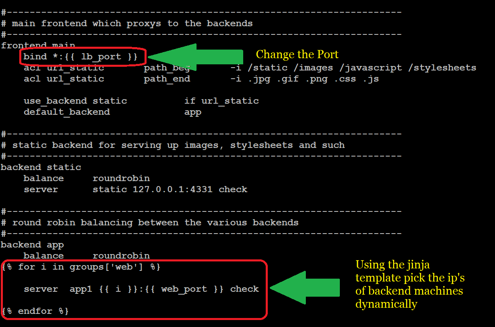

9. Now its time to run the playbook for this use the command #ansible-playbok load_balancer.yml

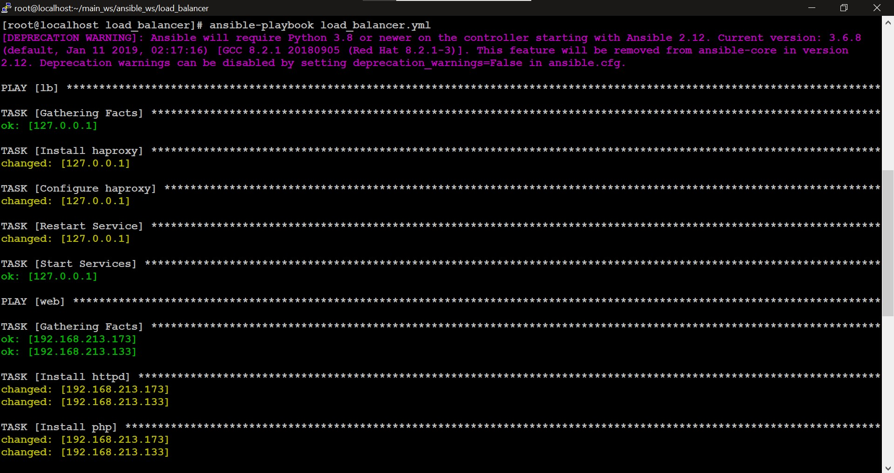

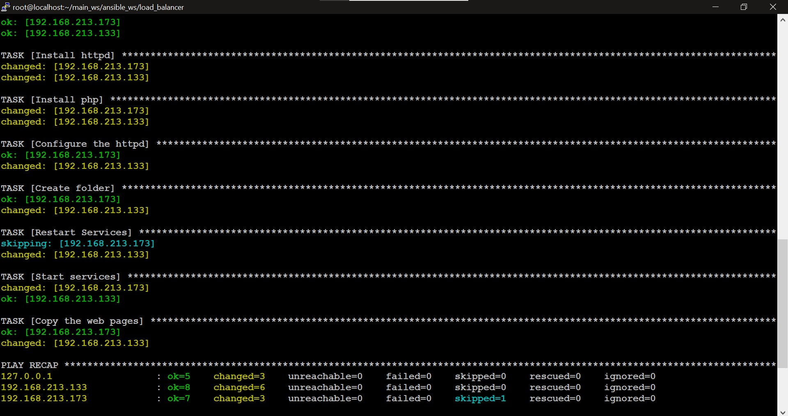

10. Now let’s check our setup is done successfully or not. For this first, let' check my local IP. with command `#ifconfig enp0s3` now we will be connecting my local IP on port 8081 as the load balancer is running on it. Now they are connecting me to the webpage of my managed node.  

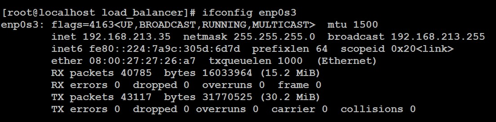

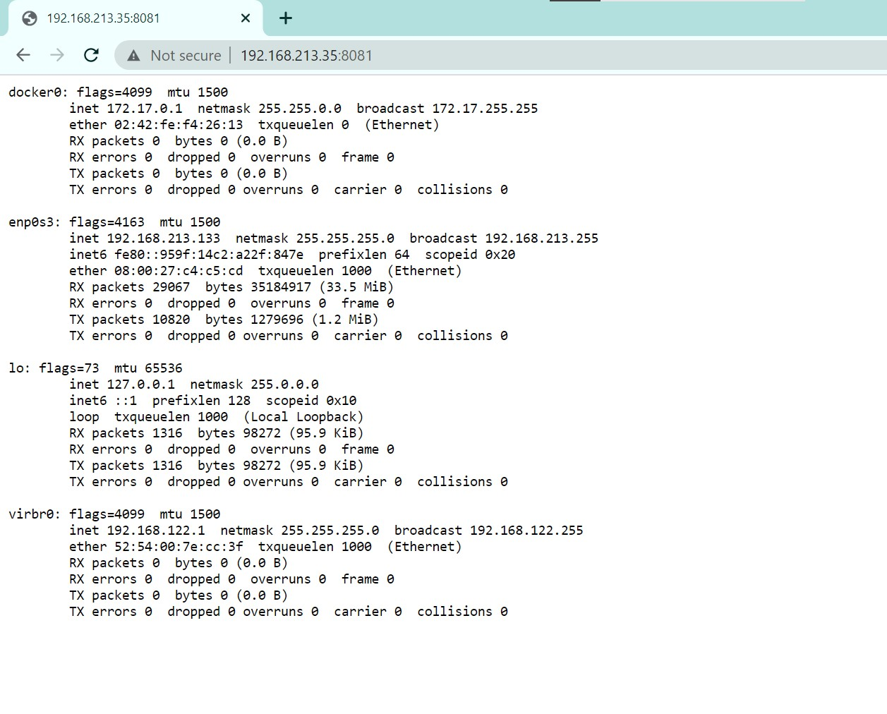

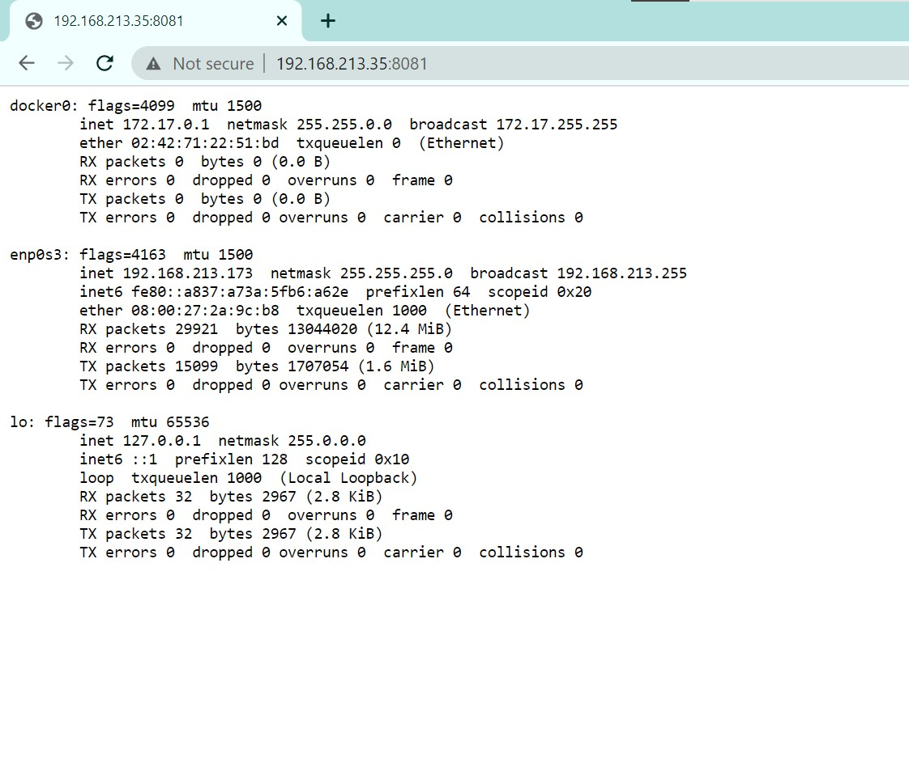

## ***We have successfully done the whole setup. So now our task is completed :) 🙌***

## ***Thanks for reading***
## ***Any query and suggestion are always welcome- [Gaurav Pagare](https://www.linkedin.com/in/gaurav-pagare-8b721a193/)***
